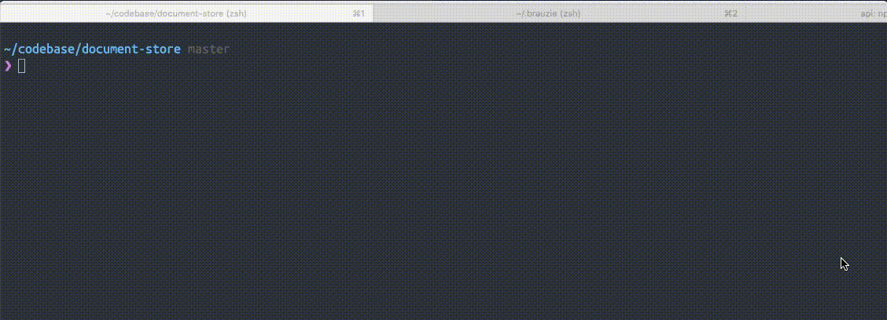

# About brauzie insomnia plugin

Using JWT in your insomnia requests? [Brauzie](https://github.com/maslick/brauzie) provides
convenient access to your jwt, so you can use it via copy & paste.

This Insomnia Plugin helps to keep your JWTs up to date, so no need to do the copy & pasting anymore!

# Preconditions

1. install [brauzie](https://github.com/maslick/brauzie) on your system and configure it according to
their docs, perhaps on a per-project basis.
2. Have the means to serve `~/.brauzie` directory locally via some static file server.
A convenient way is using python simple server as described below.

# Usage

Login using [brauzie](https://github.com/maslick/brauzie): `brauzie login` 

Serve your `~/.brauzie/jwt.json`. Make sure to exclusively bind it to localhost:
`python -m http.server 8000 --bind 127.0.0.1 --directory ~/.brauzie` – if you serve it differently,
take note of its address so you can set it properly as the `jwt` property when configuring the
insomnia `Brauzie JWT` Template Tag.

In insomnia, navigate to where you want your JWT to be placed and hit `CTRL+Space`.
Then type `brauzie` to insert the Template Tag.
